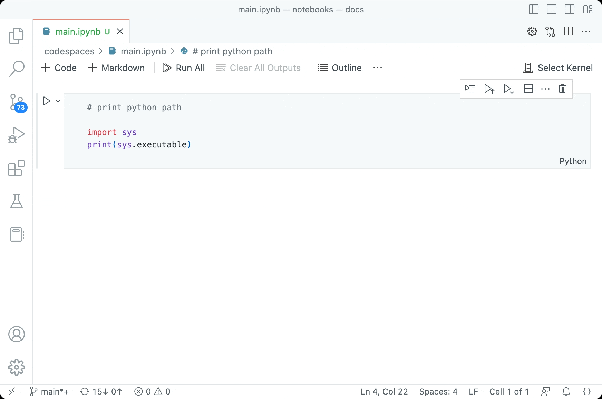

# Getting Started

## Python Venv

First, install virtualvenv using `pip install virtualenv`.

Now, you can create a venv to work in using `virtualenv --python 3.12.1 venv`

> Note: You need the specified version on python installed on your local computer to run the command above

### Working in the venv

In order to activate the venv to start working in it, use this command:

```bash
# Linux and Mac
source venv/bin/activate

# Windows
.\venv\Scripts\activate
```

To stop working in the venv, use the command: `deactivate`.

### Setting the Jupyter Notebook's Kernel

To set the Jupyter Notebook's Kernel, click the following icon and select the venv you just made.



### Installing Project Dependencies

Use the following command while in the venv to install the project's dependencies:

```bash
pip install -r requirements.txt
```
